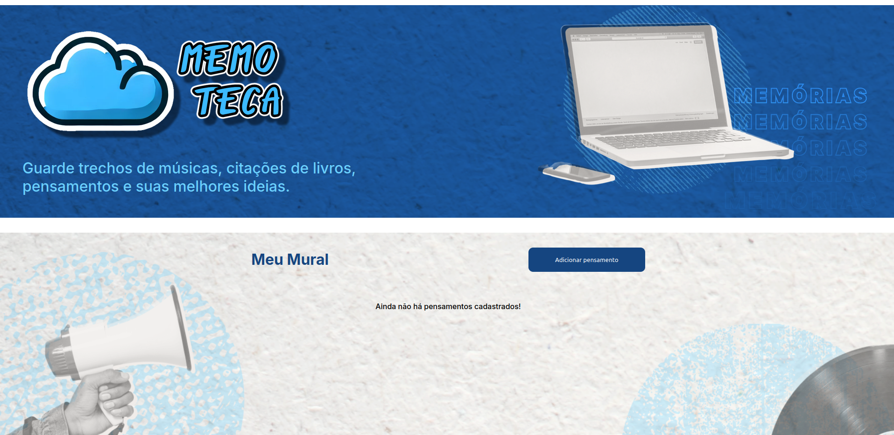
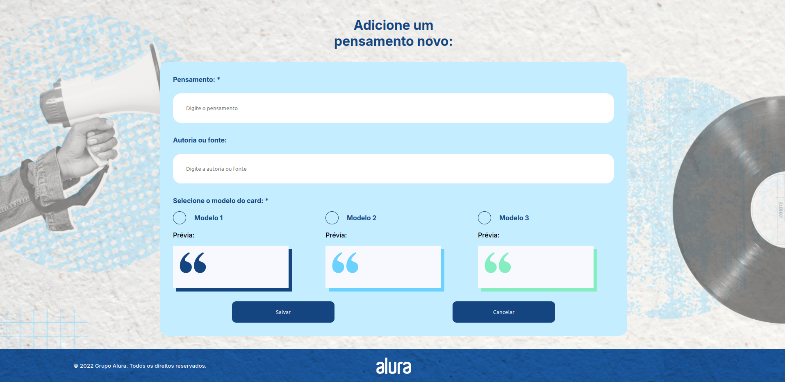
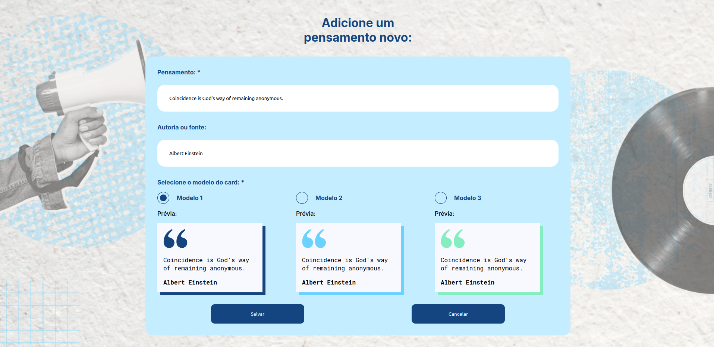
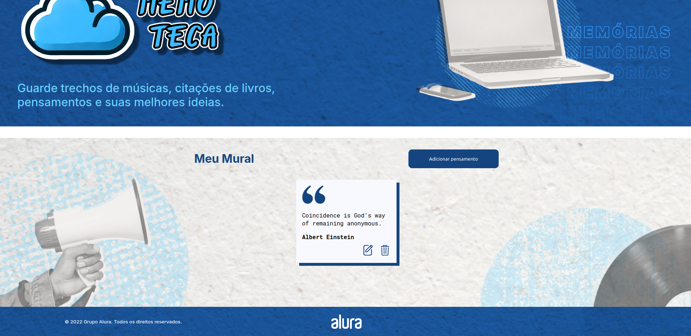
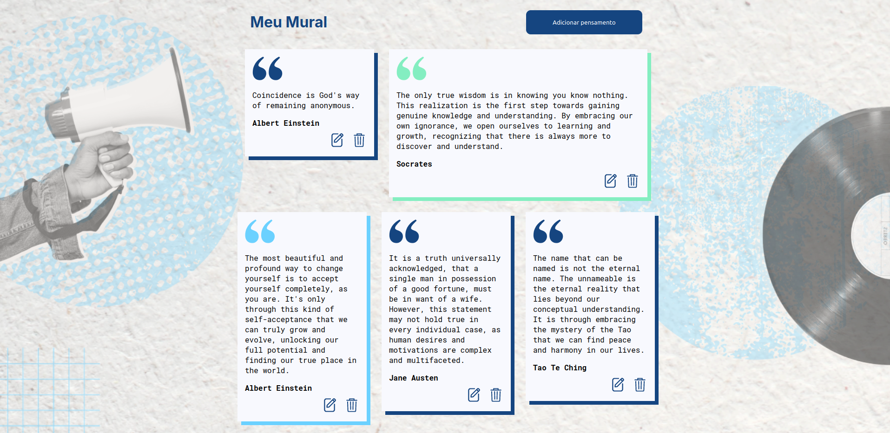

# Project Demo

## Files

### 1. `home-no-thoughts.png`

A screenshot depicting the home screen of the application when there are no thoughts present. This image illustrates the initial state of the application.  

### 2. `new-thoughts-empty.png`

A screenshot showing the "New Thoughts" section when it is empty. This image demonstrates the default view before any thoughts have been added.  

### 3. `new-thoughts-fulfilled.png`

A screenshot displaying the "New Thoughts" section with some thoughts added. This image highlights how the section appears when it contains content.  

### 4. `home-w-one-thought.png`

A screenshot of the home screen with a single thought present. This image shows how the application looks when only one thought is available.  

### 5. `home-w-multiple-thoughts.png`

A screenshot of the home screen with multiple thoughts present. This image demonstrates the layout and functionality when there are several thoughts.  

### 6. `responsiveness.mp4`

A video demonstrating the responsiveness of the application. This video showcases how the application adjusts and functions across different screen sizes and devices.  

Video:   
GIF Preview:  
  
