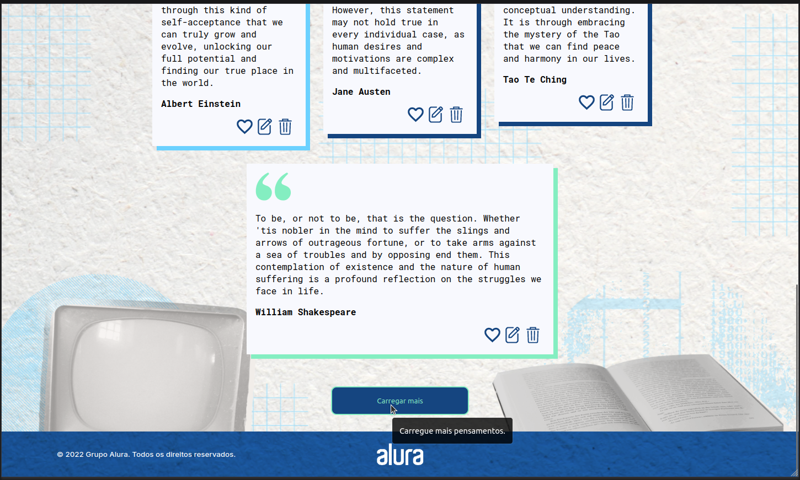
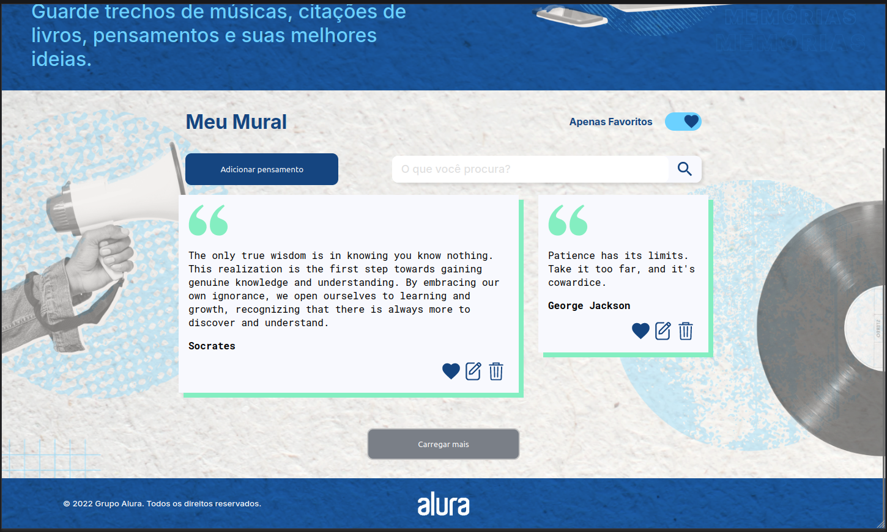
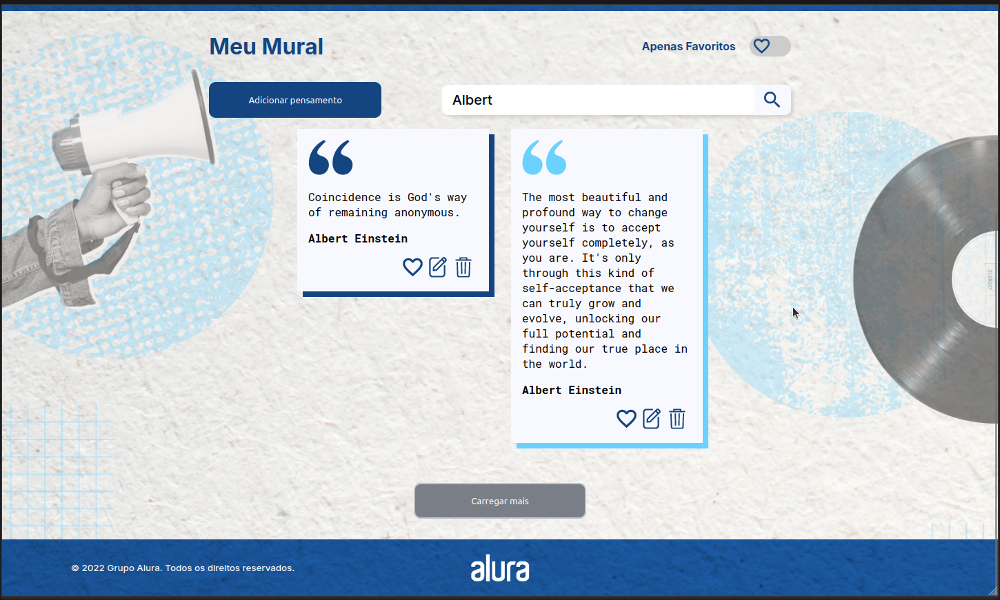
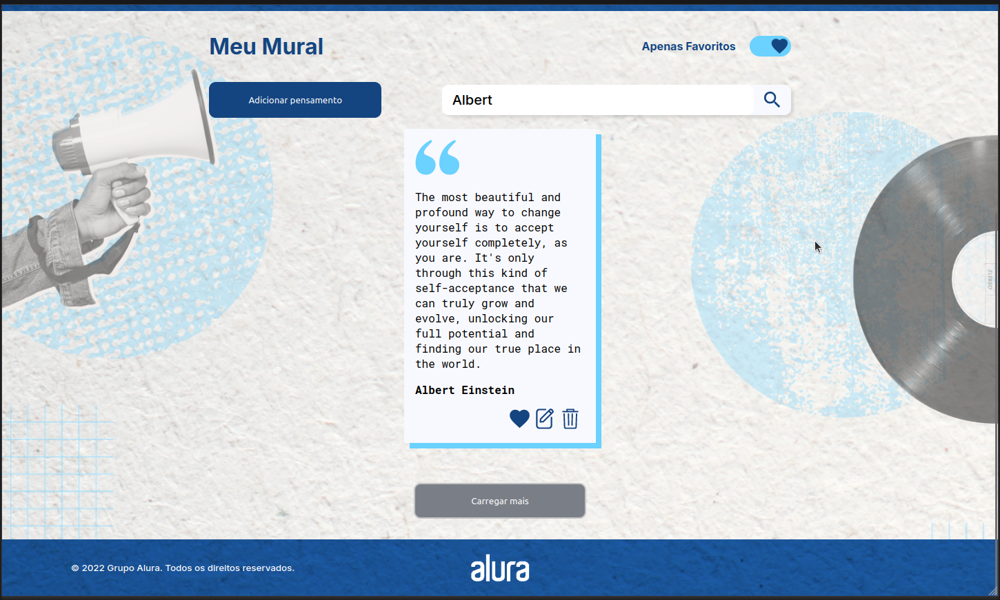
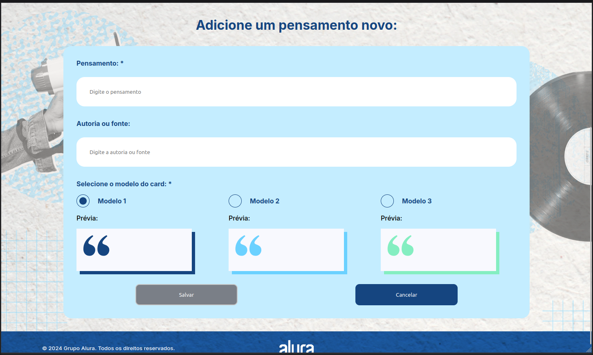
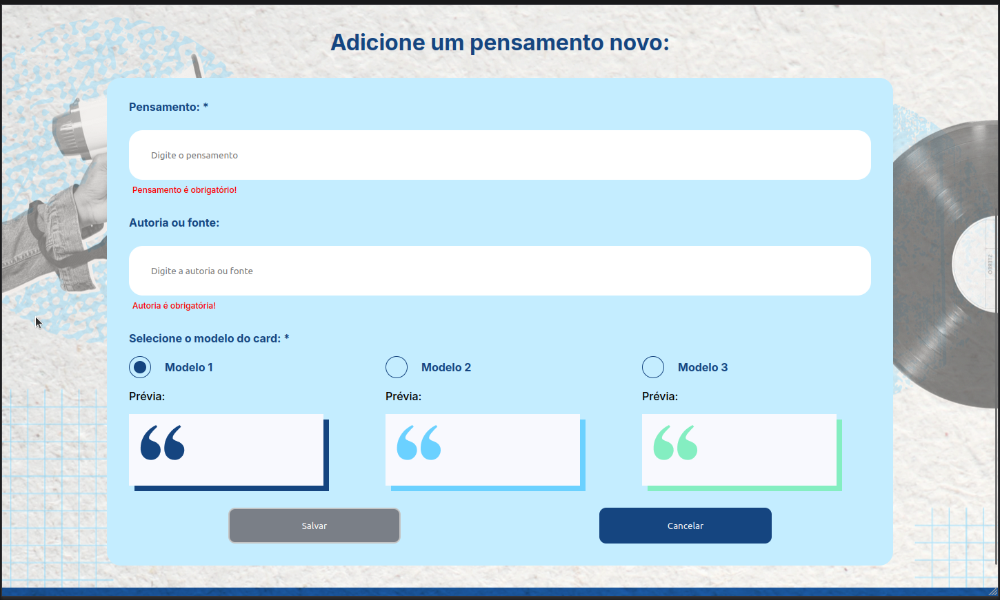
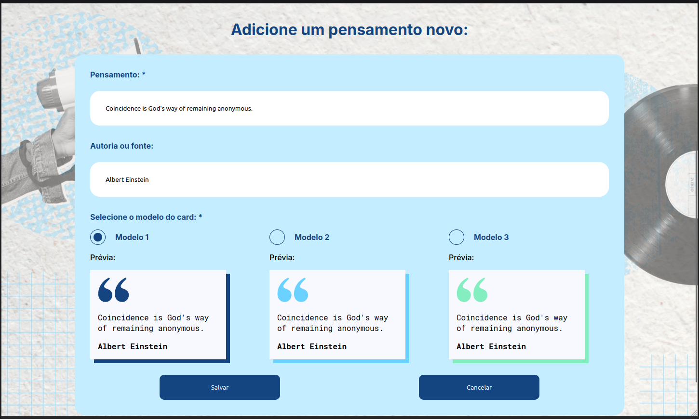

# Project Demo

## Files

### 1. `01-home-no-thoughts.png`

A screenshot depicting the home screen of the application when there are no thoughts present. This image illustrates the initial state of the application.  

### 2. `02-home-w-one-thought.png`

A screenshot of the home screen with a single thought present. This image shows how the application looks when only one thought is available.  

### 3. `03-home-w-multiple-thoughts.png`

A screenshot of the home screen with multiple thoughts present. This image demonstrates the layout and functionality when there are several thoughts.  

### 4. `04-active-load-more-thoughts.png`

A screenshot showing the "Load More Thoughts" button in an active state. This image illustrates how the button appears when it is ready to load additional thoughts.  

### 5. `05-deactive-load-more-thoughts.png`

A screenshot showing the "Load More Thoughts" button in a deactivated state. This image demonstrates how the button appears when it is not ready to load additional thoughts.  

### 6. `06-home-favorites-only.png`

A screenshot of the home screen displaying only favorite thoughts. This image shows how the application filters and displays only the thoughts marked as favorites.  

### 7. `07-home-search-for-albert.png`

A screenshot of the home screen after performing a search for "Albert." This image demonstrates how the application displays search results related to the keyword "Albert."  

### 8. `08-home-search-favorites-only.png`

A screenshot of the home screen showing the results of a search within the favorite thoughts only. This image highlights the combination of the search and favorite filters.  

### 9. `09-card-setting-as-favorite.png`

A screenshot depicting a thought card being marked as a favorite. This image illustrates the interaction where a user can designate a thought as a favorite.  

### 10. `10-new-thoughts-empty.png`

A screenshot showing the "New Thoughts" section when it is empty. This image demonstrates the default view before any thoughts have been added.  

### 11. `11-new-thoughts-missing-required-fields.png`

A screenshot showing the "New Thoughts" section when required fields are missing. This image highlights how the application prompts the user to fill in the necessary fields.  

### 12. `12-new-thoughts-fulfilled.png`

A screenshot displaying the "New Thoughts" section with some thoughts added. This image highlights how the section appears when it contains content.  

### 13. `13-responsiveness.mp4`

A video demonstrating the responsiveness of the application. This video showcases how the application adjusts and functions across different screen sizes and devices.  
Video:   
GIF Preview:  
  
